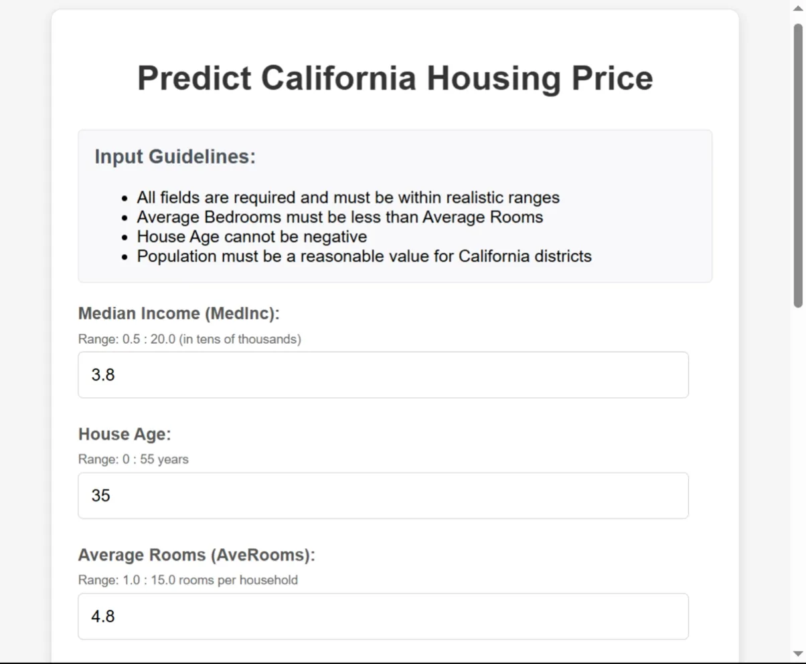
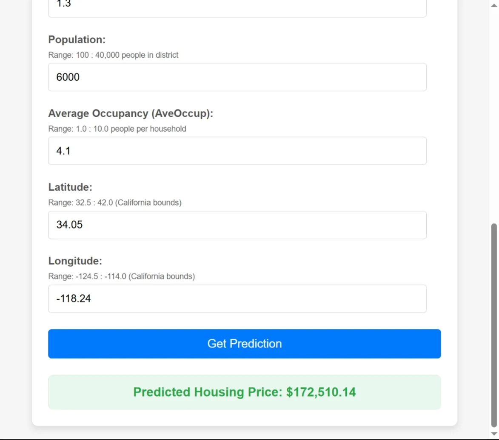
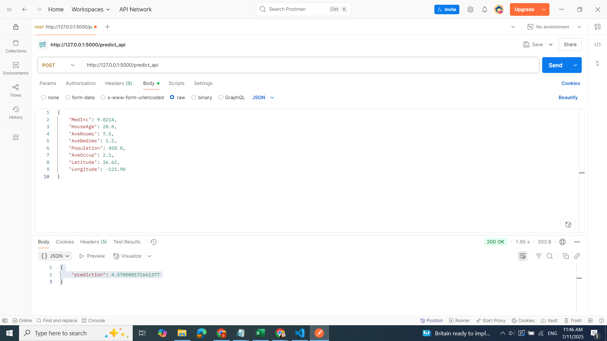
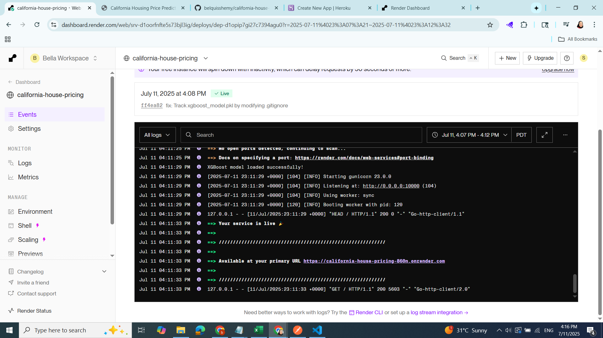
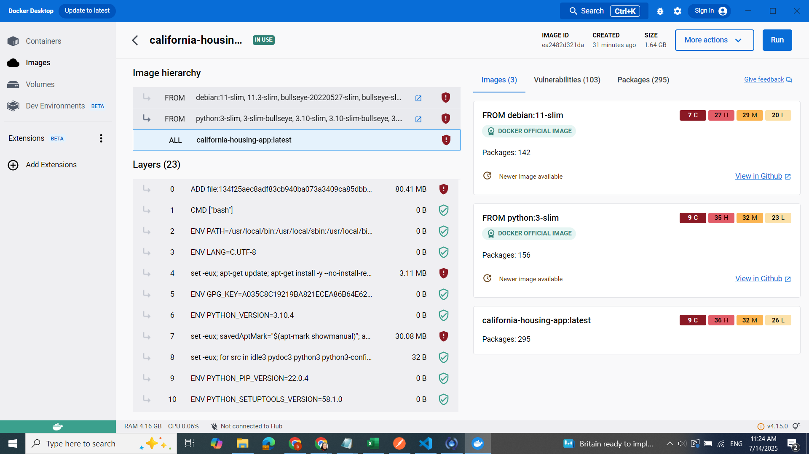
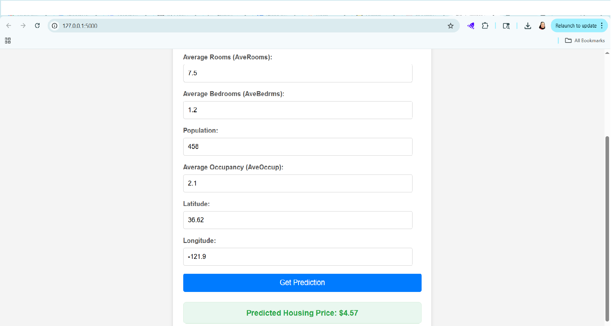

# California Housing Price Prediction 🏠

This project develops and deploys a machine learning model to predict California housing prices. It covers the entire MLOps lifecycle from data exploration and model training to containerization and cloud deployment.

## Project Overview

The goal of this project is to build a robust model capable of predicting median house values in California districts, leveraging a variety of statistical and machine learning techniques.

## Demo Screenshots




## Analysis Notebook

View the full interactive analysis and code in the Jupyter Notebook:
[View Notebook on NbViewer](https://nbviewer.org/github/belquisshemy/california-house-pricing/blob/main/cal_house_analysis.ipynb)

## Key Project Phases & Technologies

### 1. Data Analysis & Exploration 📊

- **Data Source:** California Housing Prices dataset (from `sklearn.datasets`).
- **Initial Analysis:**
  - Exploration of population distribution across districts.
  - Geographic visualization of housing prices versus population density.
  - Visualization of price categories for better contextual understanding.

### 2. Model Development & Training 🧠

- **Feature Engineering/Preprocessing:**
  - **Outlier Removal:** Applied clipping (0.05/0.95 lower and upper bounds) to mitigate the impact of outliers on model performance.
  - **Data Splitting:** Data was split into training and testing sets for robust evaluation.
- **Model Selection & Training:**
  - **Base Model:** Linear Regression (used as a baseline).
    - **Note on Scaling:** For Linear Regression, features were scaled. This is crucial for Gradient Descent-based optimization, as it makes the cost function more spherical, enabling faster and more direct convergence to the global minimum, especially crucial for quick optimization.
  - **Advanced Models:**
    - Random Forest
    - XGBoost
- **Overfitting Mitigation:**
  - Initial training revealed overfitting issues in both Random Forest and XGBoost.
  - **Regularization:** Grid Search Cross-Validation was employed to tune hyperparameters and apply regularization, improving model generalization.
- **Model Evaluation:**
  - Models were evaluated using key regression metrics:
    - Mean Squared Error (MSE) on both training and test sets (`train_mse`, `test_mse`).
    - R-squared (Coefficient of Determination) on both training and test sets (`train_r2`, `test_r2`).
    - Mean Absolute Error (MAE) on the test set (`test_mae`).
- **Best Performing Model:** **XGBoost** demonstrated the best performance after hyperparameter tuning and regularization.

  | Model   | Test MSE | Test R² | Test MAE |
  | ------- | -------- | ------- | -------- |
  | XGBoost | 0.46     | 0.8382  | 0.31     |

### 3. Model Persistence & API Development 📦

- **Model Pickling:** The best-performing XGBoost model, along with relevant results and metadata, were serialized using Python's `pickle` module for later use.
- **Flask API (`app.py`):**
  - Developed a lightweight Flask application to serve the trained model as a web API.
  - Implemented a `/predict_api` endpoint capable of accepting new housing features (via JSON POST requests) and returning price predictions.
- **Web Interface (`home.html`):**
  - Created a simple HTML frontend to provide an intuitive user interface for entering housing features and receiving predictions directly in the browser.
- **API Testing:** Thoroughly tested the API using Postman to ensure correct request/response handling and model inference.
  

### 4. Deployment 🚀

The application is deployed using a modern cloud-native approach.

- **Render (Platform as a Service - PaaS):**
  - Leveraged Render's seamless GitHub integration for **automatic deployments** on every push to the `main` branch.
  - Utilized a `Procfile` (`web: gunicorn app:app`) to instruct Render on how to run the Flask application using Gunicorn, a production-grade WSGI server.
  - **Overcame Deployment Challenges:** Successfully debugged and resolved common dependency-related issues on cloud environments, including problems with Windows-specific packages (`pywin32`, `pywinpty`) and build process errors (`maturin` / `cargo` related to read-only file systems) by carefully managing `requirements.txt` and `runtime.txt`.
    

* **Dockerization (Containerization):**
  - The project is also dockerized using a `Dockerfile`. This encapsulates the application and all its dependencies (Python interpreter, libraries, model files) into a portable container.
  - **Dockerfile Instructions:**
    - `FROM python:3.10.4`: Based on a specific Python version image.
    - `COPY . /app`: Copies all project files into the container's `/app` directory.
    - `WORKDIR /app`: Sets `/app` as the working directory.
    - `RUN pip install -r requirements.txt`: Installs all Python dependencies inside the container.
    - `EXPOSE $PORT`: Informs Docker that the app listens on a dynamically assigned port.
    - `CMD gunicorn --workers=4 --bind 0.0.0.0:$PORT app:app`: Defines the command to run the Gunicorn server when the container starts.
      

## Live Application

The California Housing Price Prediction application is live and accessible via Render:

🌐 **[https://california-house-pricing-860n.onrender.com/](https://california-house-pricing-860n.onrender.com/)**

## How to Run Locally

To run this project on your local machine:

1.  **Clone the repository:**
    ```bash
    git clone https://github.com/belquisshemy/california-house-pricing
    cd california-house-pricing
    ```
2.  **Create and activate a virtual environment:**
    ```bash
    python -m venv venv
    # On Windows:
    .\venv\Scripts\activate
    # On macOS/Linux:
    source venv/bin/activate
    ```
3.  **Install dependencies:**
    ```bash
    pip install -r requirements.txt
    ```
4.  **Run the Flask application:**
    ```bash
    python app.py
    ```
5.  Open your browser and navigate to `http://127.0.0.1:5000/`.
    

## How to Run with Docker (Locally)

1.  **Ensure Docker Desktop is running** on your machine.
2.  **Build the Docker image:**
    ```bash
    docker build -t california-housing-app .
    ```
3.  **Run the Docker container:**
    ```bash
    docker run -p 8000:8080 -e PORT=8080 california-housing-app
    ```
    (Note: You can choose any available host port to map to the container's internal port. Here, we map host port 8000 to container port 8080.)
4.  Open your browser and navigate to `http://localhost:8000/`.

## Test Cases for Prediction

To test the model's predictions, you can use the following sample data:

| Feature      | Test Case 1 (Bay Area) | Test Case 2 (Los Angeles) | Test Case 3 (San Diego) | Test Case 4 (Central Valley) |
| :----------- | :--------------------- | :------------------------ | :---------------------- | :--------------------------- |
| `MedInc`     | 6.5                    | 3.8                       | 8.2                     | 4.5                          |
| `HouseAge`   | 15.0                   | 35.0                      | 8.0                     | 28.0                         |
| `AveRooms`   | 6.2                    | 4.8                       | 7.1                     | 5.5                          |
| `AveBedrms`  | 1.1                    | 1.3                       | 1.0                     | 1.2                          |
| `Population` | 3200.0                 | 5500.0                    | 2800.0                  | 1200.0                       |
| `AveOccup`   | 3.2                    | 4.1                       | 2.8                     | 3.8                          |
| `Latitude`   | 37.7749                | 34.0522                   | 32.7157                 | 36.7378                      |
| `Longitude`  | -122.4194              | -118.2437                 | -117.1611               | -119.7871                    |

### What to Expect from Predictions:

- **Higher `MedInc`**: Generally leads to a higher predicted price.
- **Coastal locations (e.g., Bay Area, LA, San Diego)**: Tend to result in higher predicted prices.
- **Newer houses (lower `HouseAge`)**: Will likely predict slightly higher prices.
- **More rooms, fewer occupants (`AveRooms` vs. `AveOccup`)**: Often correlates with higher predicted prices.
